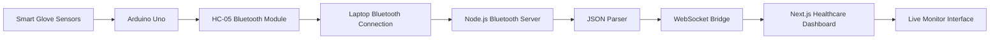
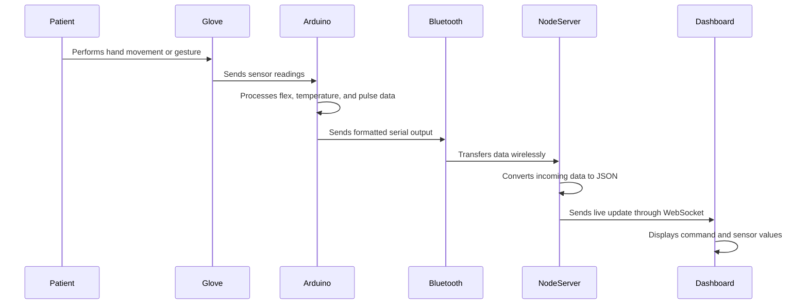
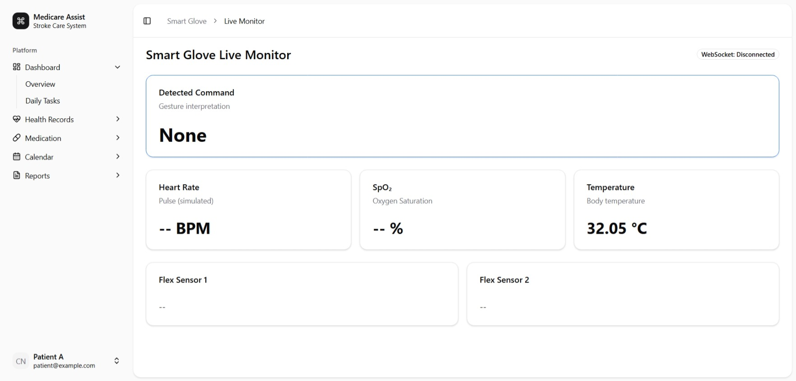

<div align="center">

# Glove System

### Arduino-Based Smart Glove for Stroke Patient Rehabilitation Monitoring

A Research Congress healthcare IoT prototype that connects an Arduino-powered smart glove to a live web dashboard for rehabilitation monitoring, gesture-based communication, and real-time patient-care assistance.

<br />

[Live Demo](https://glove-system.vercel.app) · [Research Context](#research-context) · [System Architecture](#system-architecture) · [Credits](#credits)

<br />


</div>

---

## Project Identity

**Glove System** is the technical implementation of the research project:

> **Development of an Arduino-Based Glove for Stroke Patient Rehabilitation**

The project was developed as a healthcare-focused research-product prototype for stroke rehabilitation support. It combines wearable sensors, Arduino processing, Bluetooth communication, a local data bridge, and a live web dashboard to help visualize patient movement and health-related readings in real time.

This repository documents the software, hardware communication flow, dashboard interface, and deployment pipeline created to support the working research prototype.

---

## Research Congress Highlight

This project was prepared and presented as part of a **Research Congress presentation** under Manuel G. Araullo High School.

The research explored a real healthcare problem: stroke patients may experience limited hand mobility, difficulty communicating needs, and reduced access to continuous rehabilitation monitoring. The prototype was built to demonstrate how a low-cost Arduino-based wearable system could support monitoring, emergency communication, and rehabilitation-related observation.

The system connects:

```txt
Healthcare Research
+ Arduino Hardware
+ Wearable Sensors
+ Bluetooth Communication
+ Real-time Web Dashboard
+ Patient Monitoring Interface
```

Instead of remaining as a static research idea, the project was turned into a functioning hardware-to-web prototype.

---

## Research Context

Stroke rehabilitation often requires repeated movement practice, close observation, and timely caregiver response. However, continuous rehabilitation support can be difficult because of:

- limited access to rehabilitation facilities
- high cost of long-term therapy
- shortage of rehabilitation specialists
- lack of real-time feedback in remote rehabilitation
- difficulty communicating needs during recovery
- limited monitoring outside clinical environments

This project explored how an Arduino-based wearable glove could help support rehabilitation monitoring through motion detection, physiological readings, and real-time dashboard visualization.

---

## Problem Statement

Many stroke survivors experience motor impairment, especially in the hands and upper extremities. These limitations can affect daily movement, communication, and independence.

Traditional rehabilitation and monitoring methods can be limited by accessibility, cost, and availability of professional support. While technology-assisted rehabilitation exists, many systems are either expensive, difficult to access, or lack live monitoring features.

The research asked:

> Can a low-cost Arduino-based glove provide reliable movement detection, basic vital sign monitoring, and near real-time data transmission to a website?

---

## The Solution

Glove System turns a physical smart glove prototype into a connected healthcare monitoring interface.

The glove collects movement and physiological data through sensors. The Arduino processes the readings, sends the data through Bluetooth, and a local Node.js bridge forwards the cleaned data to the web dashboard.

The dashboard displays patient-related signals in a readable live monitor interface for research, demonstration, and caregiver-support concepts.

```txt
Wearable Glove
    ↓
Sensors detect movement and vitals
    ↓
Arduino processes readings
    ↓
Bluetooth sends live data
    ↓
Node.js bridge receives and formats data
    ↓
WebSocket sends updates
    ↓
Next.js dashboard displays live monitoring
```

---

## Core Innovation

The value of this prototype is not only the glove itself. It is the full system pipeline.

```txt
Physical patient movement
        ↓
Sensor-based detection
        ↓
Arduino interpretation
        ↓
Wireless transmission
        ↓
Live web visualization
        ↓
Caregiver-readable monitoring
```

This makes the research more practical because it demonstrates how a wearable healthcare device can communicate with a deployed web system.

---

## Live Monitoring Features

### Smart Glove Inputs

- Finger flexion detection
- Hand tilt and orientation monitoring
- Gesture-based command recognition
- Temperature readings
- Heart rate readings
- Oxygen saturation support
- Emergency gesture trigger support
- Voice response module support

### Dashboard Interface

- Live command display
- WebSocket connection status
- Heart rate monitoring card
- SpO₂ monitoring card
- Body temperature monitoring card
- Flex sensor data cards
- Patient-centered dashboard layout
- Healthcare sidebar navigation
- Sections for health records, medication, calendar, reports, and daily tasks

---

## System Architecture



---

## Hardware-to-Web Data Flow



---

## Tech Stack

| Layer | Technology |
|---|---|
| Web Framework | Next.js |
| Language | TypeScript |
| Styling | Tailwind CSS |
| UI Components | shadcn/ui |
| Hardware Controller | Arduino Uno |
| Hardware Programming | Arduino IDE |
| Communication Module | HC-05 Bluetooth |
| Real-time Bridge | Node.js, WebSocket |
| Sensors | Flex Sensors, MAX30102, LM35 |
| Deployment | Vercel |
| Development Environment | VS Code |

---

## Hardware Components

The prototype was designed around accessible and low-cost components.

| Component | Purpose |
|---|---|
| Arduino Uno | Main microcontroller for reading and processing sensor data |
| Flex Sensors | Detect finger bending and movement |
| MAX30102 Sensor | Heart rate and oxygen saturation monitoring |
| LM35 Sensor | Body temperature monitoring |
| HC-05 Bluetooth Module | Wireless data transfer from Arduino to laptop/server |
| Sound Module | Voice response and alert output |
| Breadboard and Jumper Wires | Circuit assembly and testing |
| Cotton Glove | Wearable base for the prototype |
| Battery and Casing | Portable prototype support |

---

## Research Objectives

The research aimed to develop a wearable Arduino-based glove system with integrated sensors and gesture responsiveness for stroke rehabilitation monitoring.

The system focused on three major objectives:

1. **Monitor patient signals**  
   Measure movement and health-related values such as finger flexion, heart rate, oxygen saturation, and body temperature.

2. **Build a connected monitoring interface**  
   Create a website that displays Arduino data through real-time monitoring sections.

3. **Support gesture-based communication**  
   Recognize hand or finger movements and translate them into simple patient-care commands or alerts.

---

## Research Questions

The prototype was developed and evaluated around these questions:

| Research Question | Focus |
|---|---|
| How fast does data transfer from Arduino to the website? | Real-time performance |
| How consistent are repeated sensor measurements? | Precision and reliability |
| How accurate are vital readings compared to standard tools? | Measurement accuracy |

---

## Performance Summary

Based on the research testing and Research Congress presentation, the system demonstrated strong prototype-level performance.

| Evaluation Area | Reported Result |
|---|---|
| Glove-to-website transmission | Near real-time |
| Average data transfer speed | Around `0.206s` |
| Data transmission reliability | `100%` successful during trials |
| Heart rate accuracy | Around `98.21%` overall accuracy |
| Body temperature accuracy | Around `99.67%` overall accuracy |
| Flex sensor readings | Stable and responsive |
| Emergency gesture system | Functional command trigger |

These results suggest that the prototype can support live monitoring in a controlled research environment.

---

## Research Value

Glove System is valuable because it combines multiple disciplines into one working prototype:

```txt
Healthcare
+ Rehabilitation
+ IoT
+ Arduino
+ Bluetooth Communication
+ Real-time Web Systems
+ Dashboard Design
```

Most student research prototypes stop at either documentation, diagrams, or isolated hardware testing. This project goes further by connecting the physical prototype to a deployed web interface.

That makes it a more complete research-product demonstration: a wearable healthcare device concept with a visible, interactive monitoring system.

---

## My Technical Contribution

I was not part of the original research lineup. I was later brought in by the research group as a classmate developer to help turn the concept into a working technical system.

My contribution focused on the full development and integration pipeline.

### Hardware and Arduino Work

- Programmed the Arduino logic using Arduino IDE
- Helped wire and test parts of the breadboard circuit
- Connected and tested sensor modules
- Worked with flex sensor readings
- Helped prepare the hardware for live data output
- Debugged sensor behavior and Arduino serial output

### Bluetooth and Real-time Communication

- Set up Bluetooth communication on my laptop
- Connected the HC-05 Bluetooth module workflow
- Built the local Node.js bridge for receiving Arduino data
- Parsed incoming serial/Bluetooth data into usable JSON
- Connected the hardware stream to the web dashboard
- Implemented WebSocket-based real-time updates

### Web Development

- Built the live monitoring dashboard using VS Code
- Designed the healthcare dashboard interface
- Created the Smart Glove Live Monitor page
- Added sensor cards for heart rate, SpO₂, temperature, and flex sensor values
- Implemented command display for detected gestures
- Added WebSocket connection status feedback
- Deployed the website through Vercel

In short, I handled the technical development that connected the Arduino glove prototype to a functioning live web application.

---

## Dashboard Preview

```md

```

---

## Project Status

Glove System is currently a **research prototype**.

The dashboard is deployed and the hardware-to-web communication flow has been developed for demonstration and testing. The prototype is still being improved, especially in connection stability, sensor formatting, documentation, and hardware refinement.

### Current Status

- Web dashboard deployed
- Live monitor interface available
- Arduino-to-dashboard architecture developed
- Bluetooth/WebSocket bridge implemented
- Sensor display flow created
- Research presentation completed

### Needs Improvement

- More stable Bluetooth reconnection handling
- Cleaner sensor calibration flow
- Improved hardware casing
- Better mobile dashboard layout
- Historical data storage
- Caregiver notification system
- Clinical testing in real healthcare settings

---

## Roadmap

- [x] Build healthcare dashboard layout
- [x] Create Smart Glove Live Monitor page
- [x] Program Arduino sensor logic
- [x] Set up flex sensor readings
- [x] Add temperature sensor support
- [x] Add heart rate and oxygen sensor support
- [x] Configure HC-05 Bluetooth workflow
- [x] Set up laptop Bluetooth communication
- [x] Build Node.js bridge for live Arduino data
- [x] Convert hardware readings into JSON
- [x] Send data to dashboard through WebSocket
- [x] Deploy web dashboard through Vercel
- [ ] Add architecture diagram image
- [ ] Add wiring documentation
- [ ] Add demo GIF
- [ ] Improve mobile responsiveness
- [ ] Add patient profile storage
- [ ] Add historical charts
- [ ] Add offline monitoring mode
- [ ] Add caregiver alert notifications
- [ ] Improve prototype ergonomics
- [ ] Prepare cleaner public documentation

---

## Research Members

This research project was conducted by **Group 1** from Manuel G. Araullo High School.

### Official Research Group

- Jasmine Joyce C. Valdeavilla
- John Dave M. Caro
- Denisson Gelo F. Estubo
- Miguel P. Gallo
- Cyruz Kyle A. Dela Mines
- Martina Loraine G. Ilagan
- Miguel Sebastian C. Llacer

### Research Teacher

- Dr. Jeofrey R. Chan

### Technical Development Contributor

- Jansen Cadorna  
  Arduino programming, wiring support, Bluetooth setup, Node.js bridge, WebSocket integration, web dashboard development, and Vercel deployment.

---

## Academic Context

| Field | Details |
|---|---|
| Institution | Manuel G. Araullo High School |
| Department | Senior High School Department |
| School Year | 2025–2026 |
| Research Type | Quantitative Research |
| Project Category | Healthcare IoT, Rehabilitation Technology, Assistive Wearable Prototype |
| Presentation | Research Congress Presentation |

---

## Important Disclaimer

This project is an academic research prototype.

It is **not** a certified medical device. The readings, dashboard output, and gesture interpretations should not be used for diagnosis, treatment, or clinical decision-making without proper medical validation, professional supervision, and regulatory approval.

The system was developed for research, demonstration, and educational purposes.

---

## What I Learned

This project pushed me to work across both hardware and software.

I had to connect Arduino code, physical sensors, Bluetooth communication, a Node.js bridge, WebSockets, and a deployed Next.js dashboard into one working system. It taught me how difficult real-time hardware integration can be, especially when dealing with serial data, unstable Bluetooth behavior, wiring issues, and live interface updates.

It also helped me understand how software becomes more meaningful when it connects to real-world problems, especially in healthcare, accessibility, and assistive technology.

---

## Credits

### Research Project

**Development of an Arduino-Based Glove for Stroke Patient Rehabilitation**

Developed by Group 1 of Manuel G. Araullo High School for academic research and Research Congress presentation.

### Research Group

- Jasmine Joyce C. Valdeavilla
- John Dave M. Caro
- Denisson Gelo F. Estubo
- Miguel P. Gallo
- Cyruz Kyle A. Dela Mines
- Martina Loraine G. Ilagan
- Miguel Sebastian C. Llacer

### Research Adviser

- Dr. Jeofrey R. Chan

### Technical Implementation

- Jansen Cadorna

---

## Author

Technical implementation by **Jansen Cadorna**

- Portfolio: [jansencadorna.com](https://jansencadorna.com)
- GitHub: [@cadornajansen](https://github.com/cadornajansen)

---

## License and Attribution

This repository is shared for academic, portfolio, and research demonstration purposes.

If referenced, reused, or modified, please credit both:

1. the original research group behind **Development of an Arduino-Based Glove for Stroke Patient Rehabilitation**
2. the technical contributor responsible for the Arduino-to-web implementation
